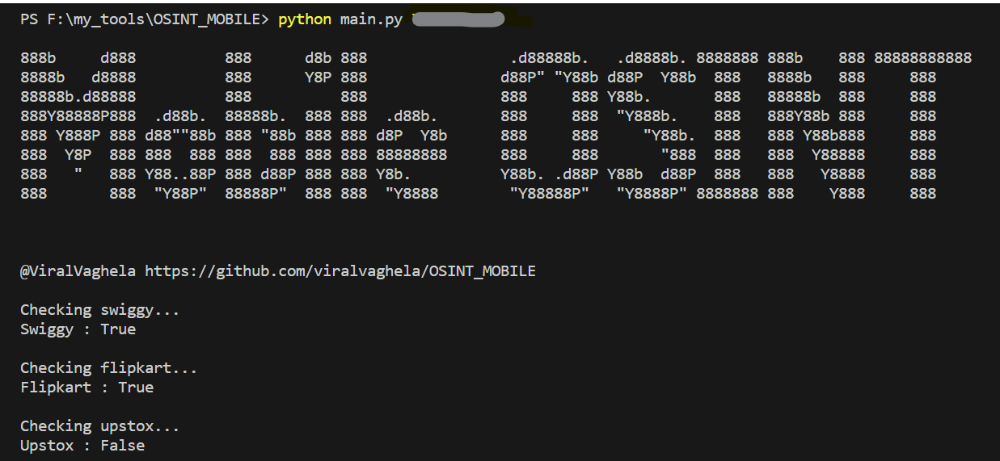

# OSINT_MOBILE
Check given number is registered on sites like  Swiggy, Flipkart, etc...
🚀 This tool streamlines the process of tracking digital footprints 👣, giving law enforcement the upper hand in the fight against cybercrime 💻 and fortifying online security. 🔒
### Screenshots


### Installation
```bash
git clone https://github.com/viralvaghela/OSINT_MOBILE
cd OSINT_MOBILE
pip install -r requirements.txt
```

### Usage
```bash
python main.py NUMBER
```

### help
```bash
python main.py -h

888b     d888          888      d8b 888                .d88888b.   .d8888b. 8888888 888b    888 88888888888 
8888b   d8888          888      Y8P 888               d88P" "Y88b d88P  Y88b  888   8888b   888     888     
88888b.d88888          888          888               888     888 Y88b.       888   88888b  888     888     
888Y88888P888  .d88b.  88888b.  888 888  .d88b.       888     888  "Y888b.    888   888Y88b 888     888     
888 Y888P 888 d88""88b 888 "88b 888 888 d8P  Y8b      888     888     "Y88b.  888   888 Y88b888     888     
888  Y8P  888 888  888 888  888 888 888 88888888      888     888       "888  888   888  Y88888     888     
888   "   888 Y88..88P 888 d88P 888 888 Y8b.          Y88b. .d88P Y88b  d88P  888   888   Y8888     888     
888       888  "Y88P"  88888P"  888 888  "Y8888        "Y88888P"   "Y8888P" 8888888 888    Y888     888     


@ViralVaghela https://github.com/viralvaghela/OSINT_MOBILE

usage: main.py [-h] phone_number

Check various services with a phone number.

positional arguments:
  phone_number  Phone number to use

options:
  -h, --help    show this help message and exit
```

### Support
Hit the ⭐️ button if this repo helped you in any way.
